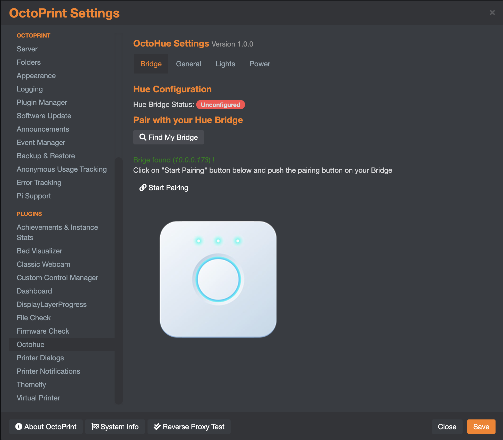

# OctoPrint-OctoHue

Illuminate your 3D print job and signal its status using Philips Hue lights — and optionally cut power to your printer automatically once it cools down.

> **A note on the gap between releases:** It has been a long time since 0.6.0 and I appreciate your patience. Version 0.7.0 is a big one — new features, a full test suite, and a lot of long-standing bug fixes. Getting this release across the line was greatly helped by AI-assisted development, which made it practical to audit and test the entire codebase in a way that simply wasn't feasible before.


## Features

- **Event-driven lighting** — map any OctoPrint event (Connected, PrintStarted, PrintDone, PrintFailed, etc.) to a specific colour, brightness, and on/off state
- **Smart plug control** — configure a Hue smart plug to cut printer power after a completed print
- **Auto power-off** — automatically switch off the plug once all extruders cool below a configurable temperature threshold
- **Bridge discovery and pairing** — find your Hue bridge on the network and pair it without leaving OctoPrint settings
- **Navbar toggle** — optional toolbar button to toggle your lights on/off at any time
- **Group support** — target individual lights or Hue rooms/zones
- **Configurable delay** — add a delay before each event triggers its light change
- **API** — `getstate`, `turnon`, `turnoff`, `togglehue`, `getdevices`, and `cooldown` commands for third-party integrations

## Installation

Install via the bundled [Plugin Manager](https://github.com/foosel/OctoPrint/wiki/Plugin:-Plugin-Manager), or manually using this URL:

```
https://github.com/entrippy/OctoPrint-OctoHue/archive/master.zip
```

**Requirements:** Python ≥ 3.9, OctoPrint, a Philips Hue bridge on the same network.

## Setup

### 1. Bridge configuration

Open OctoPrint **Settings → OctoHue → Bridge**.



- Click **Find My Bridge** to locate your Hue bridge automatically on your network.
- Once the bridge is found, press the **physical button on your Hue bridge**, then click **Start Pairing** within 30 seconds.
- OctoHue saves the bridge address and API key automatically, then takes you straight to the Lights tab to select your light — no save/re-enter cycle needed.

> If auto-discovery does not work (e.g. the bridge is on a different subnet), you can enter the bridge IP address and API key manually on the Bridge tab after pairing via the [Hue Getting Started guide](https://developers.meethue.com/develop/get-started-2/).

### 2. Light / group selection

After pairing, OctoHue opens the **Lights** tab automatically with all of your Hue lights already populated in the dropdown — just select the one you want to control.

- To control multiple lights together, first group them in the Hue app as a Room or Zone, then tick **Use group instead of single lamp** in OctoHue settings. The dropdown will switch to listing your rooms and zones.
- Set **Default Brightness** (1–255) to control how bright the light is when an event turns it on without an explicit brightness setting.

### 3. Event configuration

Still on the **Lights** tab, expand **Event Lighting Options** to configure which OctoPrint events trigger a light change. For each event you can set:

- **Colour** — hex colour code or colour picker (or switch to CT mode for white-spectrum lights)
- **Brightness** — 1–255
- **Delay** — seconds to wait before applying the change
- **Flash** — trigger a 15-second alert cycle instead of a static colour change
- **Turn off** — switch the light off after the event fires

### 4. Power control (optional)

Open the **Power** tab to configure smart plug behaviour:

- **Plug device** — select your Hue smart plug from the device list
- **Auto power-off** — automatically trigger after `PrintDone`
- **Power-off delay** — wait a number of seconds before starting the cooldown check
- **Cooldown temperature** — wait until all extruders drop below this temperature (°C) before switching the plug off; if unset, defaults to 40 °C

## API

OctoHue exposes a [SimpleAPI](https://docs.octoprint.org/en/master/plugins/mixins.html#octoprint.plugin.SimpleApiPlugin) for third-party integrations.

| Command | Parameters | Description |
|---|---|---|
| `getstate` | — | Returns `{"on": true\|false}` for the configured lamp |
| `turnon` | `deviceid` (opt), `colour` (opt) | Turn a device on |
| `turnoff` | `deviceid` (opt) | Turn a device off |
| `togglehue` | `deviceid` (opt) | Toggle a device on/off |
| `getdevices` | `archetype` (opt) | List available Hue devices |
| `bridge` | `getstatus`, `discover`, or `pair` | Bridge configuration operations |
| `cooldown` | — | Manually trigger the temperature-monitored power-down sequence |

## Compatible Events

For a full list of OctoPrint events available for triggering light changes, see the [OctoPrint Events documentation](https://docs.octoprint.org/en/master/events/index.html).

## Known Issues

- OctoHue will log a warning when sending XY colour coordinates to non-colour-capable bulbs (e.g. white-only bulbs). The bulb will still illuminate at its default colour; this is a Hue API limitation.

## Changelog

See [CHANGELOG.md](CHANGELOG.md) for a full history of changes.

## TODO

- Light capability discovery (filter event colour options by bulb capability)
- Additional smart plug archetype support
