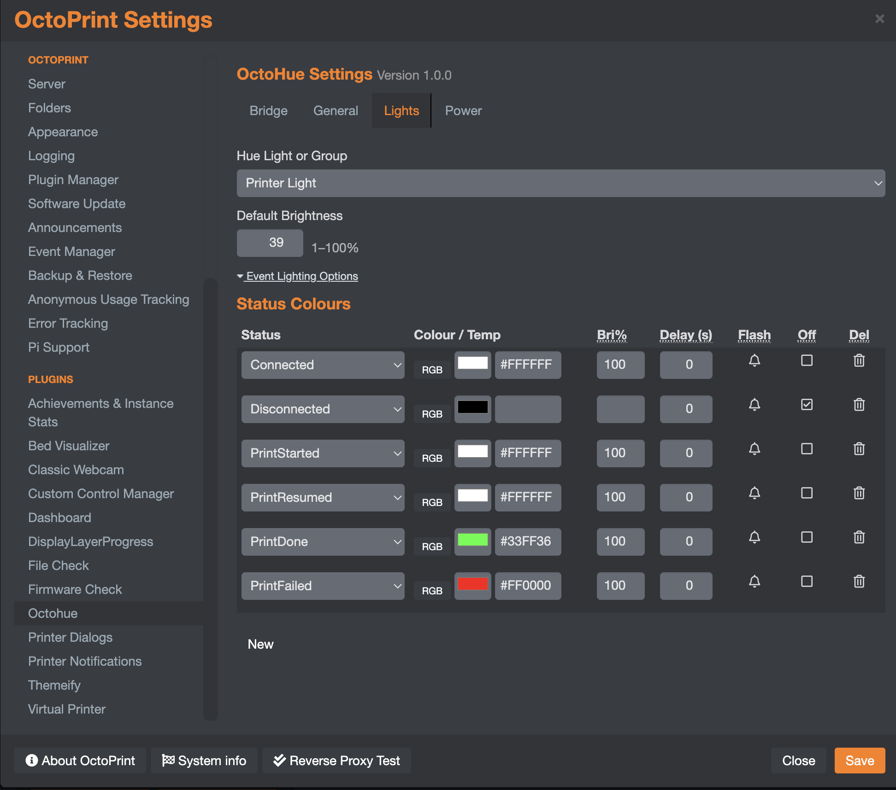
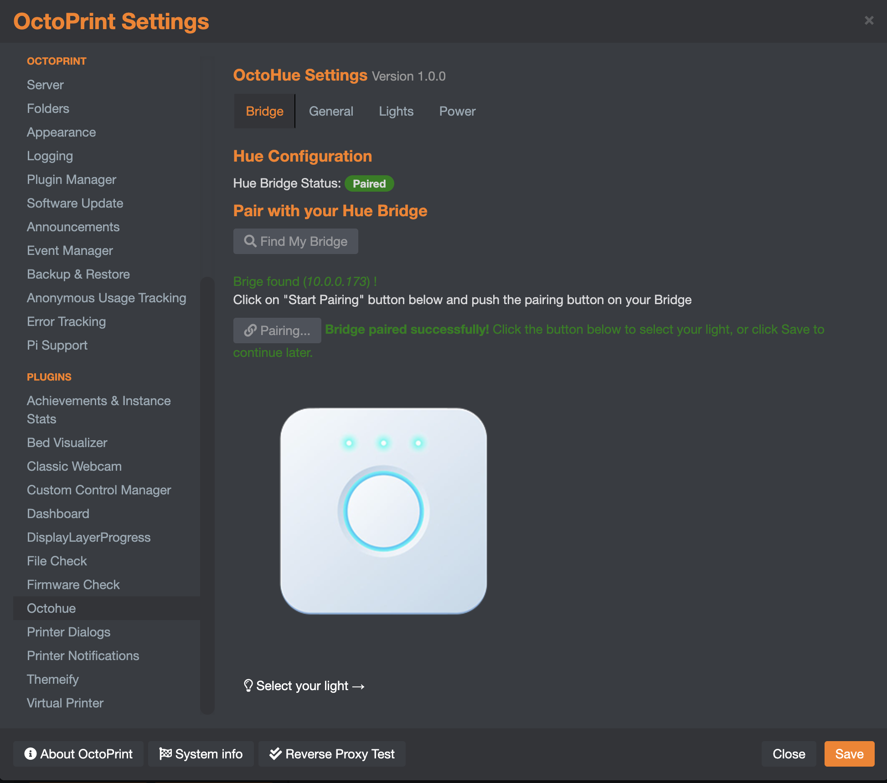
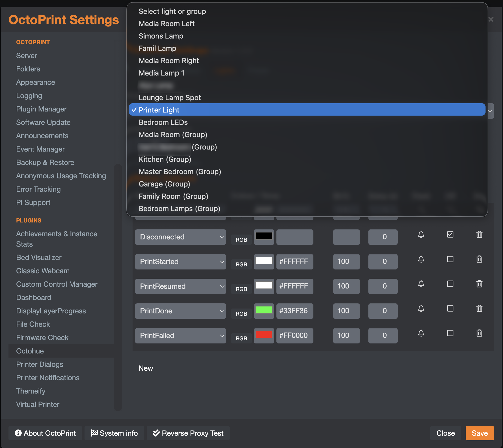

# OctoPrint-OctoHue

Illuminate your 3D print job and signal its status using Philips Hue lights — and optionally cut power to your printer automatically once it cools down.



## Features

- **Event-driven lighting** — map any OctoPrint event (Connected, PrintStarted, PrintDone, PrintFailed, etc.) to a specific colour or colour temperature, brightness, optional delay, flash alert, and on/off state
- **CT mode** — switch any event to colour-temperature (CT) mode for RGBCCT lights, activating the white channel instead of the RGB LEDs
- **Configurable toggle colour** — the navbar toggle button turns your light on with a dedicated colour, CT, and brightness you set in General settings
- **Night mode** — define a time window during which light changes are paused entirely, or brightness is capped at a configurable maximum
- **Smart plug control** — configure a Hue smart plug to cut printer power after a completed print
- **Auto power-off** — automatically switch off the plug once all extruders cool below a configurable temperature threshold
- **Guided bridge pairing** — find your Hue bridge on the network and pair it without leaving OctoPrint settings; after pairing, a single button takes you straight to the Lights tab
- **Navbar toggle** — optional toolbar button to toggle your lights on/off at any time
- **Group support** — target individual lights or Hue rooms/zones from a single combined dropdown
- **Configurable delay** — add a delay (seconds) before each event triggers its light change
- **API** — `getstate`, `turnon`, `turnoff`, `togglehue`, `getdevices`, `getgroups`, and `cooldown` commands for third-party integrations

## Installation

Install via the bundled [Plugin Manager](https://github.com/foosel/OctoPrint/wiki/Plugin:-Plugin-Manager), or manually using this URL:

```
https://github.com/entrippy/OctoPrint-OctoHue/archive/master.zip
```

**Requirements:** Python ≥ 3.9, OctoPrint, a Philips Hue bridge on the same network.

## Setup

### 1. Bridge pairing

Open OctoPrint **Settings → OctoHue → Bridge**.


- Click **Find My Bridge** to locate your Hue bridge automatically on your local network.
- Once found, press the **physical button on top of your Hue bridge**, then click **Start Pairing** within 30 seconds.
- After a successful pairing the page shows a confirmation message and a **Select your light →** button.



- Click **Select your light →** to jump straight to the Lights tab with your devices already populated — no save/re-enter cycle needed.

> If auto-discovery does not work (e.g. the bridge is on a different subnet), you can enter the bridge IP address and API key manually on the Bridge tab after pairing via the [Hue Getting Started guide](https://developers.meethue.com/develop/get-started-2/).

### 2. Light or group selection

On the **Lights** tab, select your light or group from the dropdown. Individual lights and Hue rooms/zones appear in the same list — groups are labelled **(Group)** for easy identification.



Set **Default Brightness** (1–100%) to control how bright the light is when an event does not specify its own brightness.

### 3. Event configuration

Still on the **Lights** tab, expand **Event Lighting Options** to configure which OctoPrint events trigger a light change. For each event you can set:

- **Colour / Temp** — hex colour with a colour picker (RGB mode), or a warm-to-cool slider (CT mode for white-spectrum lights) — toggle between modes with the **RGB / CT** button
- **Brightness** — 1–100%
- **Delay** — seconds to wait before applying the change
- **Flash** — trigger a 15-second Hue alert cycle instead of a static colour change
- **Turn off** — switch the light off when the event fires

### 4. General settings (optional)

Open the **General** tab to configure:

- **Lights Off on Server Shutdown** — turn the light off when OctoPrint shuts down
- **Lights On at Startup** — fire a configured event state when OctoPrint starts
- **Navbar toggle colour and brightness** — choose the colour (or CT) and brightness that the toggle button uses when turning the light on; if unset, the light turns on at the default brightness and white
- **Night mode** — set a time window during which light changes are paused or brightness is capped

### 5. Power control (optional)

Open the **Power** tab to configure smart plug behaviour:

- **Plug device** — select your Hue smart plug from the device list
- **Auto power-off** — automatically trigger the cooldown sequence after a print completes
- **Cooldown temperature** — wait until all extruders drop below this temperature (°C) before switching off; defaults to 40 °C if unset
- **Power-off delay** — additional time (seconds) to wait before starting the temperature check

## API

OctoHue exposes a [SimpleAPI](https://docs.octoprint.org/en/master/plugins/mixins.html#octoprint.plugin.SimpleApiPlugin) for third-party integrations. Light-control commands are accessible without authentication; sensitive commands require OctoPrint admin access.

| Command | Parameters | Auth | Description |
|---|---|---|---|
| `getstate` | — | admin | Returns `{"on": true\|false}` for the configured lamp |
| `turnon` | `deviceid` (opt), `colour` (opt) | any | Turn a device on |
| `turnoff` | `deviceid` (opt) | any | Turn a device off |
| `togglehue` | `deviceid` (opt) | any | Toggle a device on/off |
| `cooldown` | — | any | Manually trigger the temperature-monitored power-down sequence |
| `getdevices` | `archetype` (opt) | admin | List available Hue devices |
| `getgroups` | — | admin | List available Hue rooms and zones |
| `bridge` | `getstatus`, `discover`, or `pair` | admin | Bridge configuration operations |

## Compatible Events

For a full list of OctoPrint events available for triggering light changes, see the [OctoPrint Events documentation](https://docs.octoprint.org/en/master/events/index.html).

## Contributing

See [CONTRIBUTING.md](.github/CONTRIBUTING.md) for development setup, test requirements, and the branching and release workflow.

This project includes a [CLAUDE.md](CLAUDE.md) file that provides context for [Claude Code](https://claude.ai/code) (Anthropic's AI coding assistant). If you use Claude Code, it will automatically read this file and have the project conventions, test commands, and release workflow available from the start of each session.

## Changelog

See [CHANGELOG.md](CHANGELOG.md) for a full history of changes.
